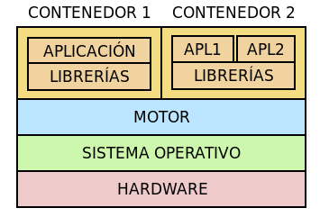

# Virtualización de plataforma
Consiste en crear un sistema informático virtual (que no existe físicamente)
que se denomina máquina virtual, constituido por un OS+hardware (=plataforma)

## Conceptos
### Máquina virtual
Es el conjunto de hardware virtual, OS y apps que corren sobre ese OS

### Hypervisor
es la plataforma software que  controla la virtualización de diferentes máquinas

### Host
Es el equipo sobre el que se hace la virtualización

### Guest
Es el equipo que corren en la VM

### Virtualización completa
Se virtualiza una plataforma hardware funcional; el guest debe usar las 
componentes de la plataforma (tener los drivers). Hay 2 clasificaciones
de virtualización completa:

#### Por tipo de Hypervisor
##### Virtualización nativa o tipo 1
En este caso, el hypervisor se ejecuta directamente sobre el hardware

Es más eficiente, ya que no "hay que pasar" por el OS del host

##### Virtualización alojada o tipo 2
En este caso, el hipervisort se ejecuta sobre el OS del host

#### Por "privilegios"
Algunas plataformas incluyen en los procesadores instrucciones para ayudar en
la virtualización del hardware; así los guests pueden ejecutar cosas 
directamente sobre el procesador sin afectar al host. Podemos tener entonces
**virtualización acelerada por hardware**, si podemos hacer lo mencionado arriba,
o **emulación**, donde la virtualización del hardware es via software (menos
eficiente)

### Paravirtualización
Para el guest no se crea un hardware virtual, tiene los drivers para hacer las
peticiones al hardware del host. Como no virtualiza hardware, mejora rendimeinto.
A cambio, no todo OS se puede paravirtualizar

Hay una versión híbrida entre la completa y la para, donde se paravirtualiza
hardware que sea difícil de virtualizar

### Containers
Se crean espacios de usuario aislados. Cada uno de estos es un contendor
que maneja sus recursos hardware asignados. Esto no virtualiza hardware
ni OS para guest; solo apps (de base o de user), que corren dentro del container.

Puedes tener contenedores de sistema, donde tienes un espacio de usuario
completo y aislado (que no incomunicado) del host. Aquí la gestión del
guest es muy parecida a la virtualización completa.

También puedes tener contenedores de aplicación; ejecutan una app aislada. Muy
de moda, gracias a Docker

Lo bueno de los containers es que pesan poco y rinden bien. Lo malo es que
como no tienen OS (usan el del host), las apps que corran en los containers
tienen que estar hechas para el OS host

## Software de virtualización
Al usar software de virtualización para instalar y probar OSs queremos,
entre otrs cosas:
- Manipular cómo se conecta la VM a la red, para simular escenarios.
No es lo mismo virtualizar un sistema de escritorio, que necesitará
salida a internet y ya, que virtualizar un server, donde necesitaremos 
conectarnos desde el host probablemente
- Poder tomar snapshots, esto es, "fotos" del estado de la VM,
para poder recuperar en caso de romper algo
- Crear plantillas de máquinas
- Virtualizar los firmwares BIOS (Basic Input/Output System) y UEFI (Unified
Extensible Firmware Interface)
- Tener mecanimos de intercambio de datos entre gurst y host
- Exportar o imoprtar VMs de un host a otro.

## VirtualBox
es un hypervisor tipo 2 con aceleración por hardware. Hay una versión con
licencia GLP. Es fácil de usar.

### Tipo de máquina
Podemos elegir, al crear máquinas, la plataforma (CPU + OS). La elección es
CPU de 32 o 64 bits; si escogemos la de 32, solo se puede instalar 
software para plataforma x86

### Red
Tenemos 4 interfaces de red:
- Desconectada: interfaz de red desconectada
- Bridged Adapter: la interfaz está en la misma red que la interfaz de verdad
a la que se conecta; esto es hacer que la VM sea una máquina más de nuestra
red local
- NAT: La VM está en una red interna exclusiva; para acceder al exterior usa
el software VirtualBox, que hace de Router y server DHCP y DNS. Esta máquina
es inaccesible desde fuera, salvo redirección de puertos (se hace desde
el software de VirtualBox)
- Red NAT: permite incluir vaias VMs en una red interna, para que se vean
entre sí. Hay que crearla previemante (la red)
- Red interna: igual que Red NAT, pero no ha enroutamiento; está completamente
aislada
- Adaptadr solo anfitrión: red exclusiva para host y guests

### Discos
Los discos del guest son ficheros en el host. VirtualBox tiene estos formatos:
- VDI (Virtual Disk Image), el nativo
- VMDK (Virtual Machine DisK), el formato abieto de VMWare
- VHD (Virtual Hard Disk), un formato de Microsoft
- RAW, es un fichero que contiene byte a byte el contenido del disco virtual.
Como es raw, su tamaño es el mismo que el del disco que virtualiza. El resto
solo se come lo que realmente esté virtualizado

Lo mejor es unar VDI, aunque se puede cambiar el formato del disco
para usarlo en otro software de virtualización.

Al usar VDI, tenemos snapshots, "multi-attach", para usar un mismo disco
como plantilla para varias máquinas.

### Arranque
Por defecto es BIOS. Se puede seleccionar UEFI (con consecuencias)

### Guest Additions
Lo primero tras instalar un OS es instalar guest additions (Devices --> 
guest addtions). Con esto, en entorno gráfico del guest se ajsta a 
la ventana del VirtualBox, y se puede copy/paste de host a guest
facilmente ajustando una config, se pueden definir carpetas compartidas
entre guest y host

### puerto serie
pdte

### exportar
Hay 2 opciones para exportar la VM a otro host:
- Exportar en formato OVA (Open Virtual Appliance). No respeta snapshots.
Generará en el host destno un VDI con el estado último
- Copiar el dir donde esté la VM al host destino y "añadir" una nueva VM
usando el ficheor `.vbox`. Puede dar problemas si todo lo que necesitamos
no está en el directorio