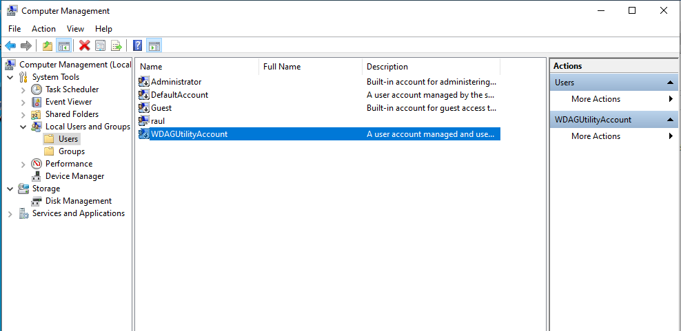
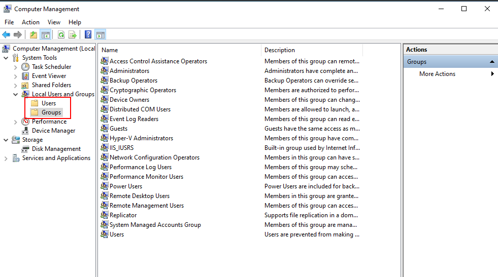
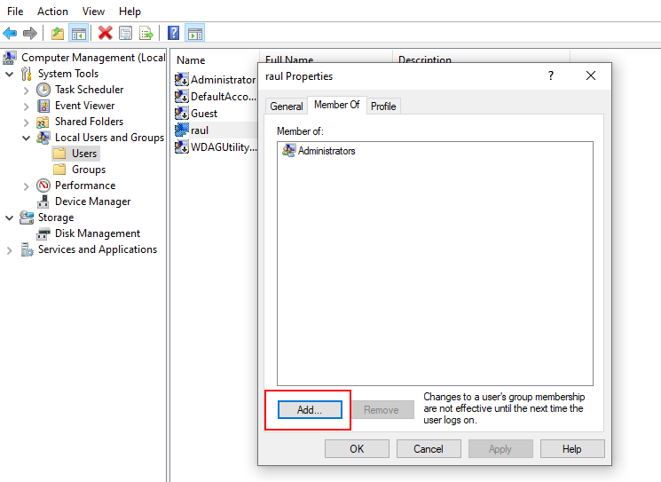

# usuarios windows
Los usuarios (locales) permiten acceder al OS, a sus recursos
(directorios, ficheros...) y a servicios (apagar máquina, programas...)

Los usuarios pueden ser locales (pertenecen a la máquina física donde están
definidos) o de red (que no vamos a ver).

Cuando hemos hecho una instalación de Windows, hemos creado al menos
un usuario con el que meternos al sistema. Windows por detrás te ha creado
otros: Admin, DefaultAccount, Guest y un admin del antivirus.

Todas estas cuentas de usuario están deshabilitadas por defecto.

## Ver los usuarios locales
De manera gráfica, podemos ir a "This PC" (este equipo), botón derecho,
"Manage" (administrar) y tendremos el panel de adminstración del equipo,
de ahí podemos navegar hasta los usuarios locales:



<!-- También podemos verlos con con PowerShell (la terminal de windows) via

```powershell
Get-Localuser
```

o con

```powershell
Get-WmiObject Win32_UserAccount
``` -->

A grandes rasgos, tenemos 3 tipos de usuarios en el sistema:
- Admin (desactivado), tiene control absoluto sobre el sistema (como root
    en linux)
- Guest (invitado, desactivado); son usuarios con acceso limitado al OS,
    se les crea un perfil temporal al abrir sesión y se borra al cerrar sesión.
    No puede gestionar software, ni configuraciones (crear, borrar, modificar)
    No puede gestionar grupos ni usuarios
- Usuarios: son "las personas" que van a usar el OS; según permisos
    podrán hacer más o menos cosas. El usuario incial que creamo en instalación
    es a efectos un Admin. Lo correcto será usar esa cuenta para configurar
    lo que necesitemos y luego usar otra (nunca es bueno trabajar con una
    cuenta que pueda romper cosas)

## Dar de alta usuario local
Solo podrá admin o usuario con privilegios suficientes (como el uuario que
creas en instalación).

Para crear usuario desde GUI, en el panel de management damos a "more actions"
-> new user, y rellenamos los campos; son bastante autoexplicativos.

Quizás mencionar tema de contraseñas por seguridad del sistema: es buena idea
que el admin genere una contraseña para el usuario y que le obligue a cambiarla
en el primer login. El usuario cambiará la pass; el admin no podrá saber
la nueva pass pero podrá controlar la cuenta e incluso cambiarle la pass
cuando quiera. También es buena idea que la contraseña expire cada cierto
tiempo (por defecto 42 días; podremos más adelante cambiar esto). En general no
es buena idea que el usuario no pueda cambiar su contraseña, pero dependerá
de cómo quieras gestionar los accesos al sistema; si prefieres ser tú
como admin quien gestiona todas las pass y se las vas pasando a los usuarios,
hazlo así.

Finalmente, la opción de crear cuentas deshabilitadas a veces es buena idea.
Se suele hacer en casos que sabes que va a llegar un nuevo usuario al sistema
(una contratación en la empresa que se incorpora en 1 mes, por ejemplo);
entonces lo que harías es crear su cuenta, configurarla... y dejarla 
deshabilitada, de esta manera cuando la persona se incorpore solo hay que
habilitarle la cuenta.

También la deshabilitación de cuenta sirve para denegar acceso de manera
temporal al sistema (una persona que se va de excedencia, por ejemplo)

<!-- Podemos también crear usuario via PowerShell con:

```powershell
# crear usuario local con contraseña
New-LocalUser usuario -Password Retamar1@
# crear usuario local con contraseña segura
$pass=ConvertTo-SecureString "Retamar1a" -asplaintext -force
New-LocalUser usuario -Password $pass
# crear usuario local con la contraseña enmascarada
$pass = Read-Host -AsSecureString
New-LocalUser usuario -Password $pass

---- opts---

AccountExpires           {}     
AccountNeverExpires      {}     
Description              {}     
Disabled                 {}     
FullName                 {}     
Name                     {}     
Password                 {}     
NoPassword               {}     
PasswordNeverExpires     {}     
UserMayNotChangePassword {}     
Verbose                  {vb}   
Debug                    {db}   
ErrorAction              {ea}   
WarningAction            {wa}   
InformationAction        {infa} 
ErrorVariable            {ev}   
WarningVariable          {wv}   
InformationVariable      {iv}   
OutVariable              {ov}   
OutBuffer                {ob}   
PipelineVariable         {pv}   
WhatIf                   {wi}   
Confirm                  {cf}
``` -->

Para modificr la pass de un usuario, damos botón derecho (o en el menú) sobre el 
usuario y elegimos la opción de ``set password``. Nos amenaza pero
no pasas nada; eso sí, si cambiamos una pass, tenemos que decirsela al usuario.

## Modificar/borrar usuario local
De nuevo, todo podemos hacerlo desde el panel de control, doble click en
el usuario y cambiamos lo que necesitemos.

OJO: no se eliminan los ficheros asociados al usuario, es decir
lo que esté en `C:\Users\usuario`

## Otras cosas sueltas
Cuando creas un usuario by se loggea por primera vez, aparte de comerse
el rollo de config básica de Windows, se le creará un directorio
personal en `C:\Users\usuario`. Cuando se crea ese directorio personal,
en realidad se está copiando el contenido del directorio `C:\Users\Defualt`,
que contiene los por defecto de un usuario (por ejemplo, si meto un
fichero hola.txt en el escritorio de Defualt, cuando cree un usuario
tendrá ahí su fichero hola.txt).

Además, lo que hay en el directorio `C:\Users\Public` es común a todos los
usuarios (un fichero en `C:\Users\Public\Desktop` lo verán todos los
usuarios)

La config personal del usuario está en `C:\Users\usuario\NTUSER.DAT` 
(esto es un archivo de registro que se lee en login)

## Admin de passwords
Buscamos (en la barra de busqueda) "Local security policy" (directivas
de seguridad local). Si vamos a "Account Policy -> Password Policy" podemos
gestionar las reglas de password de los usuarios. Las opciones que nos dan:

- forzar historia: no puedes reutilizar un password hasta que no tienes X nuevos
- max/min age: tiempo mínimo y máximo de vida de un password
- min pass lenght: tamaño mínimo del passsword
- min pass length audit: sirve para que si se crea un nuevo password 
    de tamaño no "correcto" Windows escriba en un log que ha ocurrido esta
    casuística.
- requisitos de complejidad: la pass debe cumplir ciertos requisitos, se
    pueden ver en help

En general es buena idea forzar a los usuarios a que tengan contraseñas seguras
y que se cambien cada cierto tiempo (3 meses suele ser algo habitual en
las empresas), para evitar el robo de sesiones; especialmente importante
si las máquinas contienen datos sensibles.

## Perfiles de usuario
Una herramienta un poco cutre pero es útil para tener una idea rápida de
qué hay en la carpeta Users. para llegar aquí, 
clcik derecho en ThisPC --> advanced setting y hay una tab de user
profiles. Ahí veremo, entre otras cosas útiles, si hay algún
usuario "desconocido" y cuánto espacio se come cada usuario.


También tengo una herramienta dsde Computer Management para gestionar
los perfiles (configs) de usuario; realmente puedo hacer poco, como
mover su ficheor de profile a una nueva ubicación, indicar un script
de loggeo (es decir, que cuando el usuario se conecte se ejecute ese
script, puede ser por ejemplo configurar variables de entorno o
enchufas unidades de red), y podemos también cambiarle la home a donde nos 
de la gana

## Grupos
Igual que en Linux, existe el concepto de grupo en Windows, que son
entidades que sirven para agrupar usuarios y que la gestión de la
seguridad sea más cómoda.

Todo usuario (salvo usuarios espaciales del sistema) debe pertenecer a 
un grupo. Los usuarios pueden pertencer a uno o varios grupos.

Para gestionar los grupos se llega de la misma manera que a los usuarios:



Windows crea sus propios grupos por defecto, a destacar:
- Administradores: los que tienen acceso completo al sistema local. El usuario 
    que creamos en la instalación está en este grupo (recurda que el usuario 
    admin es inaccesible)
- Usuarios: se les permite hacer las tareas habituales: ejecutar programas, 
    ctener su espacio para crear/borrar/modificar ficheros... No se les 
    permite acer cambios (accidentales o intencionados) en el sistema.
    Cuando creamos un usuario caerá en este grupo por defecto.
- Invitados: Son como los usuarios pero con más restricciones.
- Otros grupos como: replicadores (para duplicar archivos), configuradors de
    red, usuarios de escritorio remoto...

Para administrar grupos, igual que usuarios. Podemos agregar usuarios
(que ya existan) al crear el grupo o a posteriori, e incluso podemos
ir directamente al usuario y agregarlo a un grupo:



Los grupos no son modificables: existen o no existen; solo puedes cambiar
quién pertence al grupo y borrarlos. PERO borrar el grupo implica que se pierdan
los permisos asociados al grupo y por tanto esos permisos desaparecen de los
usuarios