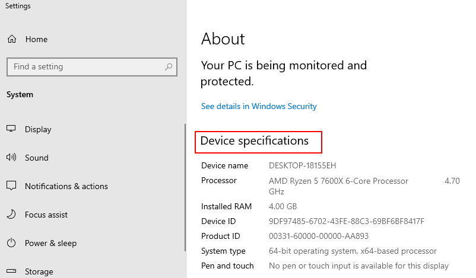
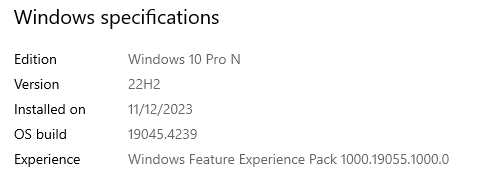
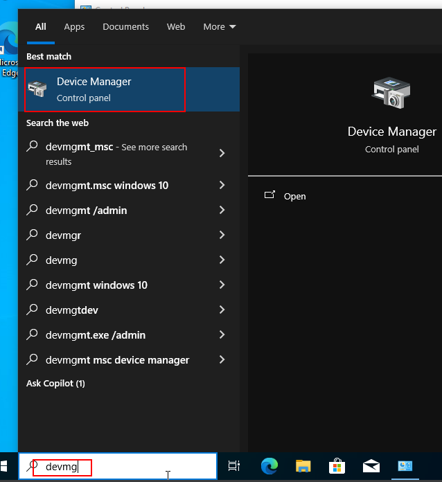
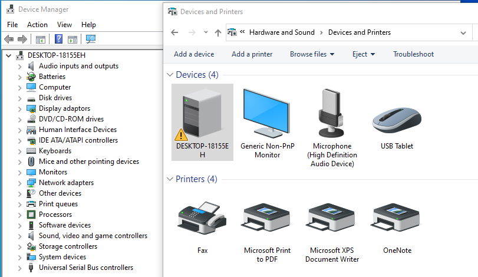
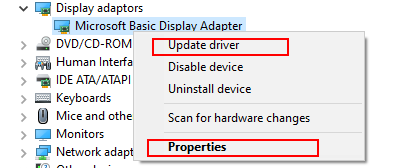
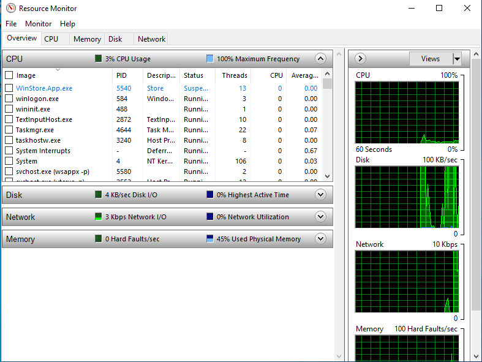

# Gestión de recursos hardware
Primero, para obtener la información básica sobre nuestro equipo, tenemos
que ir a Control Panel (escribir "CP" en la barra de búsqueda), y buscar
el botón de system:

Eso nos llevará a la siguiente pantalla:

Donde podemos ver tanto la info del dispositivo (procesador, su velocidad,
RAM instalada, tipo de OS) así como las características concretas de
la versión de windows que tenemos instalada

Para saber sobre el espacio de alamcenamiento que tengo, basta ir a la
pestaña de Storage:

Y obtendremos la información que necesitamos para gestionar correctamente el
sistema, así como acciones recomendadas

Lo siguiente es saber encontrar los dispositivos físicos que detecta el sistema;
para ello podemos acceder o bien desde el CP, o buscando el programa 
`devmgmt.msc` en la barra de búsqueda:

Que nos llevan a estos paneles donde podemos ver el hardware de nuestro sistema
Lo que nos muestran estos paneles son todos los disposivios físicos que
están instalados en el equipo.

También nbos indicará de alguna manera si hay algún probema con el dispositivo,
en general ante cualquier problema de u dispositivo hardware lo primero
que debemos instentar es actualizar el driver del dispositivo, a ver si
con eso se soluciona. Para ello, buscamos el dispositivo problemático y pulsamos
botón derecho para abrir las propiedades o directamentwe damos a actualizar
driver:

Si eso no soluciona nuestros problemas, nos toca meternos a properties e 
indagar por qué podrían estar funcionando las cosas mal, pero es un 
trabajo muy específico para cada problema específico

## Rendimiento del sistema
Para ver cómo va el sistema (en directo) tenemos el task manager (CTRL+MAYUS+ESC)
en la tab de "performance":

Donde nos da una idea general de qué tal está el equipo y si se están consumiendo
muchos recursos. Aunque está bien para hacerse una idea general, que nos puede
indicar por qué nuestro equipo no está funcionando como es debido,
debemos combinar esta información con las tabs de procesos, servicios para
identificar exactamente quien se está comiendo los recursos del sistema.

Otra opción es abrir el resource monitor, que lo tenemos en la misma tab de
performance, y nos muestra la siguiente pantalla:

Allí tendremos un overview de todos los procesos que están en el sistema
corriendo actualemnte, junto con tabs específicas para el uso de CPU, uso de
memoria, uso de disco y de red, junto con el lisado de procesos que están 
haciendo uso de los recursos.

Lo cómodo de esta GUI es que podemos gestionar los procesos directamente
desde ahí, basta con dar la botón derecho y nos salen las opciones...

Lo malo suele ser que tenemos que ir jugando con este visor junto con el
admin de tareas para identificar exactamente qué procesos (via el PID) son
los problemáticos

(Supongo que es un buen momento hacer un ejemplo de un poco de forénsica
con por ejemplo Chrome, que se come un montón de RAM)

Otra tab interesante que nos aparece en el task manager es la de 
startup:

Esta app se refiere a aquellas aplicaciones que se inician automáticamente
cuando se inicia el sistema. Una muy típica es MicrosoftOneDrive para tener
un backup en la nube de nuestros ficheros.

Podemos gestionar directamente desde aquí las app que se inician automáticamente 
en login, siendo especialmente importante el "enable" o "disable" y la info que
nos da el propio sistema soibre el impacto que tienen en el arranque.

Deshabilitar app en arranque que consuman muchos recursos (marcadas con impacto
high) hará que el arranque del sistema sea mucho más rápido, a cambio de
tener que gestinarlas manualmente nosotras mismas despuès

Nota: no toda app tiene por que ser ejecutable en startup, especialmente
las que sean un 3rd party. Podemos ver todas las disponibles buscando
en la barra de búsqueda `startup apps`:

Y habilitando con el botoncito de al lado

## gestion de discos
ver: https://sio2sio2.github.io/doc-linux/guias/0222.som/09.admwin/index.html#monitorizacion
## mejor gestion de la memoria
libro, 9.1.4

